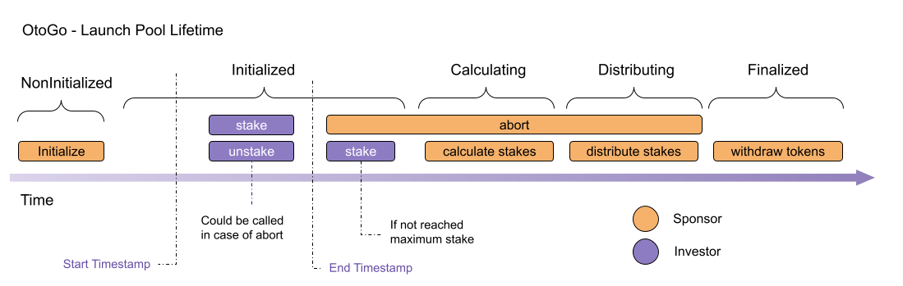

# OtoGo - Launch Pools

This project consists on a Factory Contract that deploys customized Launch pools with different attributes. Each Launch pool is controlled by its Sponsor, who is responsible for setting its attributes and take decisions during pool lifetime.

## Specifications

#### Pool Lifetime

- **NonInitialized** - First stage of the launch pool before initialized, since it's a clone, isn't possible to use constructor functions for a clone, in this case we use the "initialize" function of the new Launch Pool to set its parameters.
- **Initialized** - Right after a Launch Pool is initialized the `stake`/`unstake` is defined by values `_startTimestamp` and `_endTimestamp`. If `_startTimestamp` isn't reached, no action could be taken by investors. Once `_startTimestamp` is reached, Investors could `stake` and `unstake` freely. Once `_endTimestamp` is reached, only `stake` could be called in case still have some space for it.
- **Paused** - Paused stage has to be triggered by Sponsor in case of any problem occurs, once `pause`, all `stake`/`unstake` is not allowed.
- **Calculating** - Once `_endTimestamp` is reached, the sponsor needs to call `lock` function. Once called, lock function will lead to Calculation stage. In this stage, Sponsor are allowed to trigger `calculateSharesChunk` to calculate how much shares each stake will receive in return, the shares is calculated as long has gasLeft > 100000 on the transaction, once has no gasLeft enough, the contract stops calculation on the current index, and the function needs to be called again, this should repeat until all investor has their shares calculated.
- **Distributing** - Once all shares is calculates, the contract automatically trigger the stage Distributing. At this stage, sponsor should trigger `distributeSharesChunk` on the smart contract transferring all calculated shares to respective investors. This happens the same way as calculations, the shares is distributed as long has gasLeft > 100000 on the transaction, once has no gasLeft enough, the contract stops distribution on the current index, and the function needs to be called again, this should repeat until all investor has their shares distributed.
- **Finalized** - Once the last share is distributed, the previous function automatically triggers Finalized stage. At this stage, the only function that could be triggered by the Sponsor is `withdrawStakes`. Doing that, Sponsor is allowed to withdraw all staked tokens by the investors.
- **Aborted** - Once at some moment of the launch pool, in case sponsor call `abort` function. The only function that could be called in launch pool is the `unstake` function. So each investor could retrieve their staked tokens.



## Installation

Installing Ganache-cli (Local Ethereum Blockchain):

```sh
npm install -g ganache-cli
```

Installing Truffle + Mocha:

```sh
npm install -g truffle mocha
```

Installing dependencies:

```sh
npm install
```

## Tests 

Running ganache cli:

```sh
ganache-cli -p 8545
```

Running mocha tests:

```sh
truffle test
```

## Glossary 

- Factory Administrator - Define new types of curves that could be used, define the source code of launch pool to create Clones.
- Sponsor - The launch pool creator/owners, the one who defined all specifications of the launch pool and trigger transactiosn to proceed to next steps and abort launch pool in case of any problem.
- Investor - The user who stake/unstake some value on launch pool and receive some shares related to the project on launch pool is concluded.


## References:

#### Liquidity Pool And DAOs
[Balancer Liquidity Pool](https://medium.com/balancer-protocol/building-liquidity-into-token-distribution-a49d4286e0d4)

[BentoBox](https://boringcrypto.medium.com/bentobox-to-launch-and-beyond-d2d5dc2350bd)

[Sushi SWAP Documentation](https://help.sushidocs.com)

[Balancer Core Repo](https://github.com/balancer-labs/balancer-core)

[DAO Repo](https://github.com/blockchainsllc/DAO/blob/develop/DAO.sol)

#### ICOs

[ICO Smart Contracts](https://github.com/TokenMarketNet/smart-contracts/tree/master/contracts)

#### Calculating Bonuses

[Token Bonding Curves](http://coders-errand.com/token_bonding_curves/)

[More Token Bonding Curves](https://hackernoon.com/more-price-functions-for-token-bonding-curves-d42b325ca14b)

#### Identity and Whitelisting

[The Basics of Decentralized Identity](https://medium.com/uport/the-basics-of-decentralized-identity-d1ff01f15df1)

[3ID Provider](https://github.com/ceramicstudio/js-3id-did-provider)
[3ID Connect](https://github.com/ceramicstudio/3id-connect)

[Metamask Identity using textile.io](https://github.com/textileio/js-examples/blob/master/metamask-identities-ed25519/)

[UPort Decentralized ID ERC-1056](https://github.com/uport-project/ethr-did)

[Claims Registry](https://github.com/ethereum/EIPs/issues/780)

[Library to Create Verifiable Credentials](https://github.com/decentralized-identity/did-jwt-vc)
